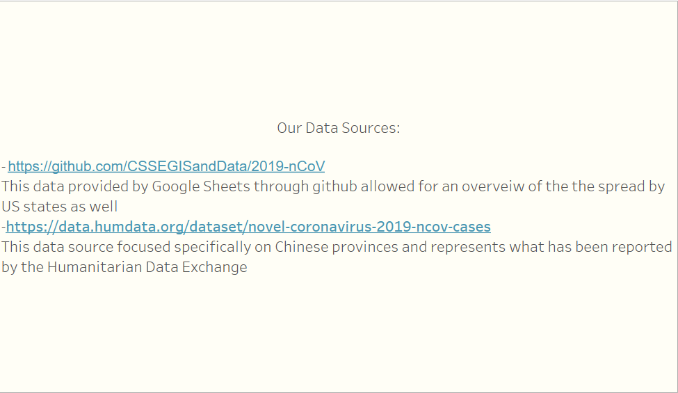
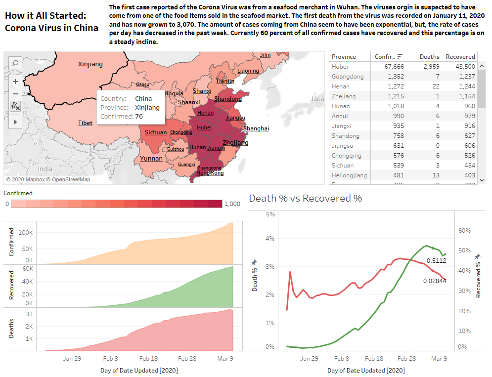
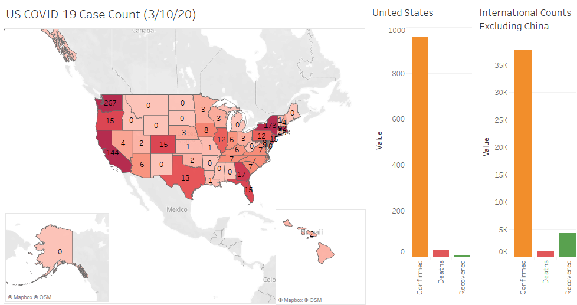
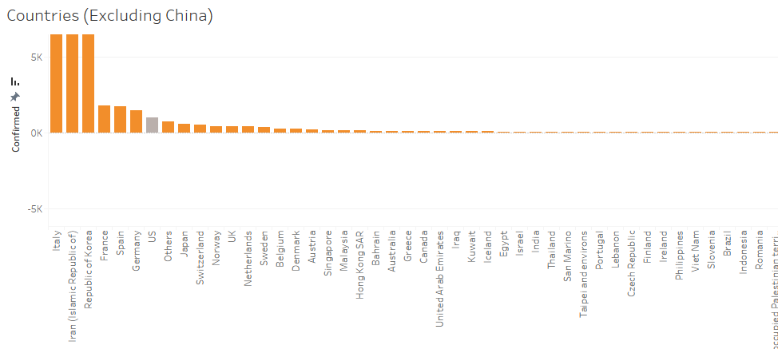
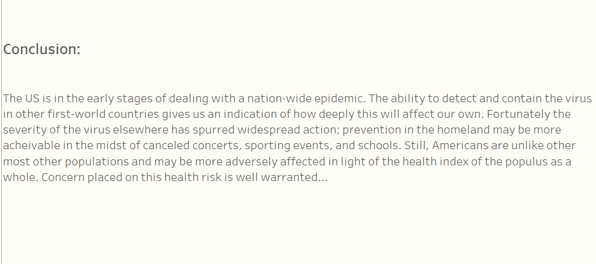

# COVID-19-AmericanChinesePerspective
In our Tableau story we concentrate on the Corona Virus through the perspectives of China and the United States. Our main focus was to compared where the virus started (China) to one of the many countries it has spread to(United States). One astonishing detail our team picked up on was how fast China was able to control the virus. It will be interesting to see how other countries respond and if they respond as effectively as China. 

Last updated: 3/11/2020

## Chinese Perspective

## American Perspective 

